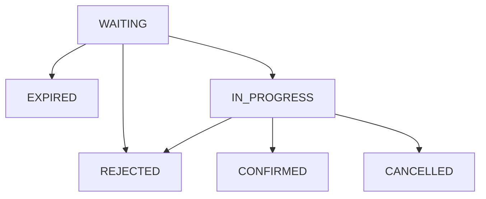

# Job Application Tracker

The "Job application tracker" is a software helping me keep track of the job application i sent.
Here I can record different information about the job, the most relevant are:
- The day the application has been sent
- The name of the company
- When company replaied
- If the process went further than the first HR interview

## Application state

A job application process is described by states. The state of the application follows a state-machine, listed in the next paragraph.

### The application states
- WAITING    : the application has been sent and waiting for a message from the company you applied for
- IN_PROGRESS: the company replied positively and the inteview process is going on
- CONFIRMED  : the application processes ended successfully. Offered accepted
- REJECTED   : The application ended unsuccessfully in any steps of the process.
- CANCELED   : The application has been ended by the applicant
- EXPIRED    : The company did not provided any ansewr

### Application state machine



## API reference

In progress..


## API Reference

The Job application tracker ansers to: http://localhost:8080/

#### API 1

```http
  GET /
```

| Parameter | Type     | Description                |
| :-------- | :------- | :------------------------- |
| |  | |
| |  | |


## Run Locally

IN PROGRESS...

Clone the project

```bash
  git clone https://link-to-project
```

Go to the project directory

```bash
  cd my-project
```

Install dependencies

```bash
  npm install
```

Start the server

```bash
  npm run start
```


## 🔗 Links
[](https://www.linkedin.com/in/tomas-pinto-motnip/
)
[](https://tomas-pinto.medium.com/)
[](https://stackoverflow.com/users/7395303/tomas-pinto)


