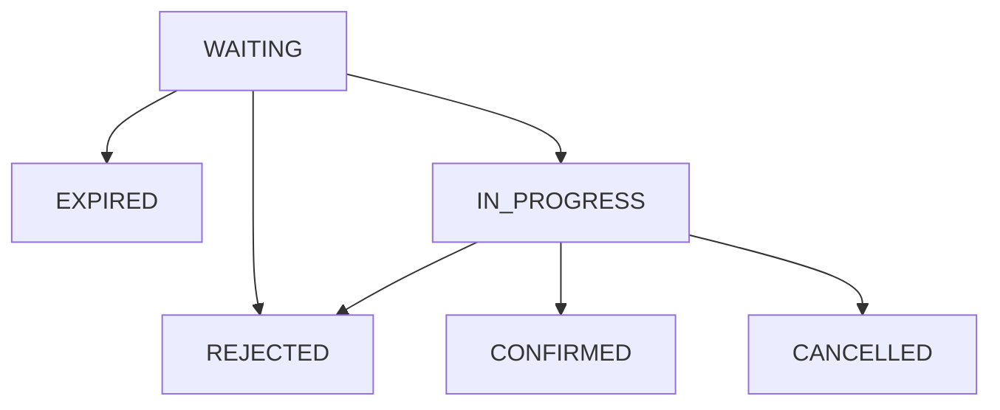

# Job Application Tracker

## Description
The "Job application tracker" is a software helping me keep track of the job application i sent.
Here I can record different information about the job, the most relevant are:
- The day the application has been sent
- The name of the company
- When company replaied
- If the process went further than the first HR interview

### Technical note
The code is in Java with Spring Boot.
The database is in-memory database HD. The database will be migrated to Postgresql and Docker file will be added.
### Note
This project continuously evolve. Time to time there will be changes, improvements and new features.
Scope of the project is to illustrate the way I work and develop software. 
## Application state

A job application process is described by states. The state of the application follows a state-machine, listed in the next paragraph.

### The application states
- WAITING    : the application has been sent and waiting for a message from the company you applied for
- IN_PROGRESS: the company replied positively and the interview process is going on
- CONFIRMED  : the application processes ended successfully. Offered accepted
- REJECTED   : The application ended unsuccessfully in any steps of the process.
- CANCELED   : The application has been ended by the applicant
- EXPIRED    : The company did not provide any answer

### Application state machine




## API Reference

The Job application tracker answers to: http://localhost:8080/

Detailed API documentation can be find at: http://localhost:8080/swagger-ui/index.html
### Job application APIs
List of API to handle application
#### Create new application

```http
  POST /application
```
##### Body request

```json

{
    "companyName": [String],
    "applicationDate":[String - yyyy-mm-dd],
    "description":[String - job description or link to it],
    "note":[String]
}
```
#### Update job application status with the date when the company reply

```http
  PATCH /application/{{applicationId}}/firstContact-date
```

| Parameter       | Type   | Description                            |
|:----------------|:-------|:---------------------------------------|
| applicationId     | Number | application's ID                       |

###### Body request

```json
{
  "fistContactDate":[String - yyyy-mm-dd]
  "state": [REJECTED|IN_PROGRESS]
}
```
#### Change state of an existing application

```http
  PATCH /application/{{applicationId}}/state?newstate=IN_PROGRES
```
###### Body request

| Parameter     | Type   | Description                                       |
|:--------------|:-------|:--------------------------------------------------|
| applicationId | Number | application's ID                                  |
| newstate      | String | EXPIRED,REJECTED,IN_PROGESS, CONFIRMED, CANCELLED |

#### List all the application

```http
  GET /application
```
### Note about a job application APIs 
List of API to handle note about an application

#### Add note to an existing application

```http
  POST /application/{{applicationId}}/notes
```

| Parameter       | Type   | Description                            |
|:----------------|:-------|:---------------------------------------|
| applicationId     | Number | application's ID                       |

```json

{
    "text": [String]
}
```

#### List note of the give note

```http
  GET /application/{{applicationId}}/notes
```

| Parameter       | Type   | Description                            |
|:----------------|:-------|:---------------------------------------|
| applicationId     | Number | application's ID                       |

## Run Locally

IN PROGRESS...

Clone the project

```bash
  git clone https://link-to-project
```

Go to the project directory

```bash
  cd my-project
```

## 🔗 Links
[](https://www.linkedin.com/in/tomas-pinto-motnip/
)
[](https://tomas-pinto.medium.com/)
[](https://stackoverflow.com/users/7395303/tomas-pinto)


